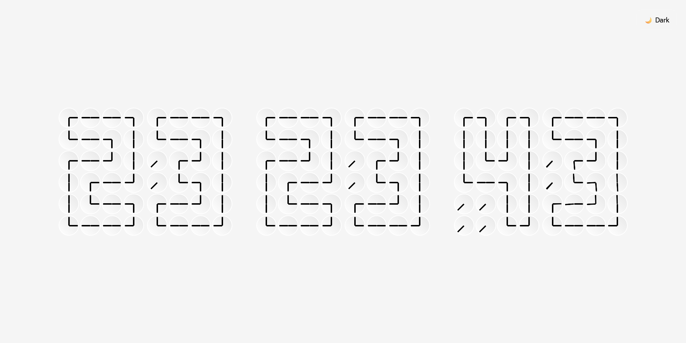
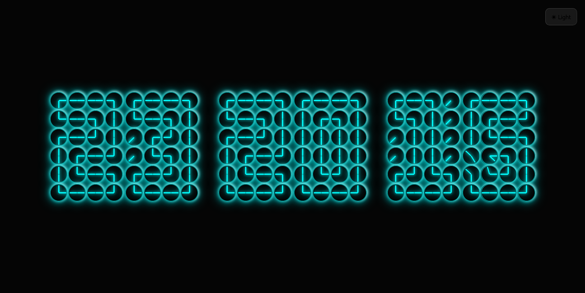

**⏱️ Clock Made of Clocks — React Edition**

A visually striking digital clock built entirely from analog clocks, implemented using React with smooth animations, precise time synchronization, and an elegant Light / Dark theme system.

This project explores creative UI engineering, combining geometry, motion, and state-driven rendering to produce a clock that feels both technical and artistic.

**✨ Features**

🕒 Clock made of clocks — each digit is constructed from multiple animated analog clocks
⚛️ Pure React architecture (Vite-based setup)
🎨 Light & Dark themes with smooth transitions
🌌 Neon glow effect in Dark Mode for high contrast and readability
🎬 Full-screen cinematic theme transition
⏱️ Perfect second-level synchronization (no drift)
📱 Responsive design — adapts across screen sizes
🚀 Zero external UI libraries — everything built from scratch
🌗 Theme Preview
☀️ Light Mode

🌙 Dark Mode (Neon)

🧠 How It Works
The current time (HH:MM:SS) is split into digits.
Each digit maps to a predefined clock-hand orientation grid.
Every small clock is an independent component driven by CSS variables.
Angle normalization ensures smooth clockwise motion without jumps.
Dark mode switches clock faces to black, allowing the neon hands and glow to stand out clearly.

This ensures:
No backward rotation
No flickering
Clean, readable digits even in dark environments

🛠️ Tech Stack
React (Functional Components + Hooks)
Vite (Fast development & build)
CSS Variables for dynamic theming
Modern CSS animations (clip-path, transitions)
JavaScript Date API

▶️ Running Locally
# install dependencies
npm install

# start development server
npm run dev

Then open:
http://localhost:5173

**🎯 Design Philosophy**
This project focuses on:

Clarity over clutter
High contrast for accessibility
Motion with purpose
No unnecessary abstractions
Every visual decision — especially in Dark Mode — follows real neon UI design principles.
🚧 Possible Enhancements
🌈 RGB / color-selectable neon modes
💾 Persist theme preference with localStorage
✨ Pulse glow synced with seconds
🌌 Animated cyberpunk background
📦 Package as a reusable React component

📜 License

This project is open-source and free to use for learning, experimentation, and inspiration.
will update this repo soon 
stay tuned
👤 Author

Nagraj (Nikhil) Rangarej
B.Tech — Artificial Intelligence & Data Science
Exploring creative systems, UI engineering, and future-focused software design.
